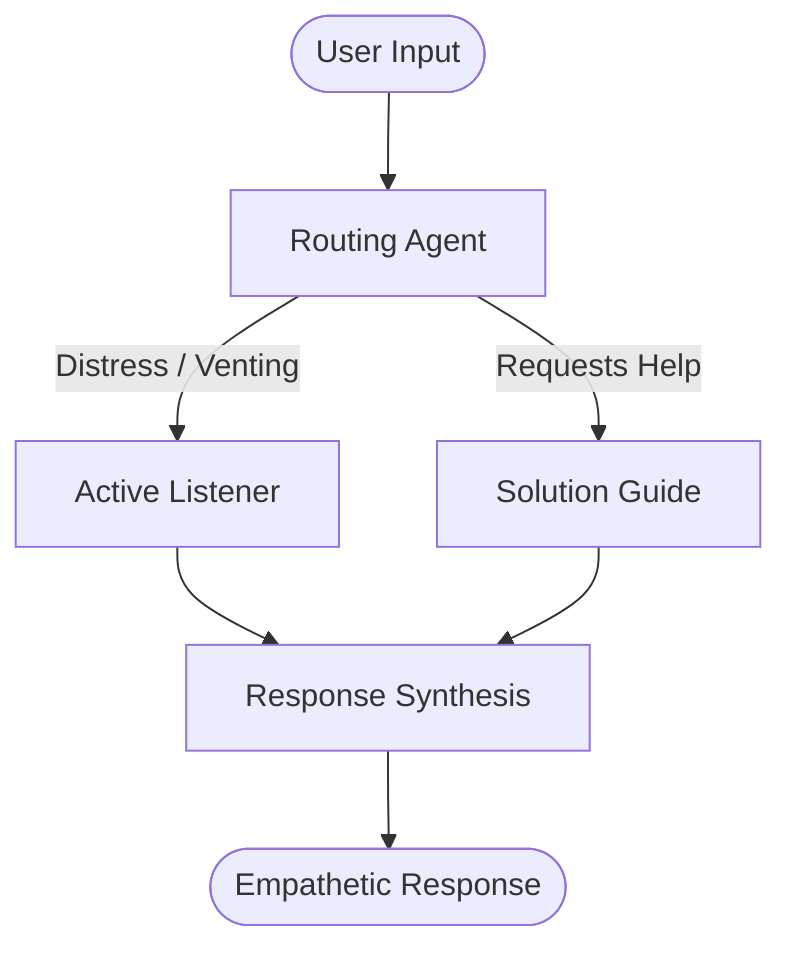

# Case Study: Buds Chatbot

## Overview
Buds is a conversational companion designed to help people reflect and process their emotions through structured, empathetic dialogues. The goal was to build a system that feels supportive and conversational rather than cold and transactional.

## Problem Statement
Most traditional chatbots use rigid decision-tree dialogues that fail to adapt when users express complex emotions or shift topics. They can feel frustratingly mechanical, which breaks trust when a user is seeking a listening ear.

## Architectural Design
Buds leverages a multi-agent routing architecture to address this issue:
*   **Routing Agent**: Analyzes user input sentiment and selects the appropriate downstream persona.
*   **Active Listener Agent**: Focuses on validation and reflection.
*   **Solution Guide Agent**: Offers practical advice if the user requests help.

## Technical Stack
*   **Platform**: Native Android App (Kotlin, Android Jetpack)
*   **LLMs**: Gemini 1.5 Pro, Claude 3.5 Sonnet
*   **Routing Engine**: Custom JSON router matching schema patterns

## Timeline & Milestones
*   **Week 1**: Ideation & Conversation Flow Mapping
*   **Week 2**: Router Prompt Tuning & Multi-Agent Scripting
*   **Week 3**: Android UI Development (Jetpack Compose)
*   **Week 4**: Testing, Integration & Optimization
