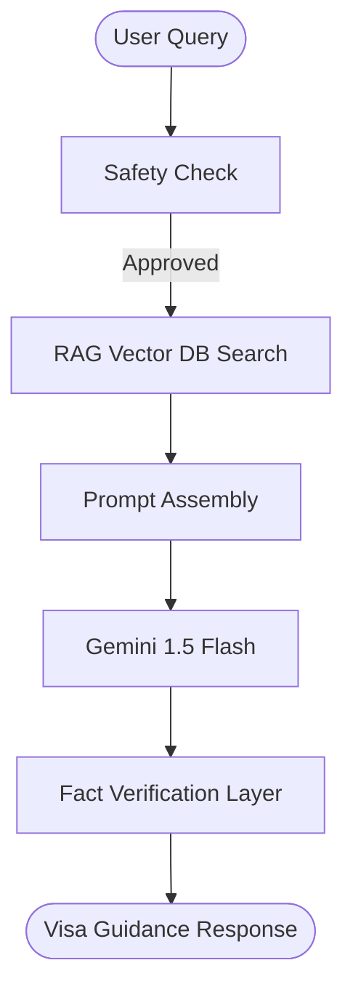

# Case Study: Visa Helper AI

## Overview
Visa Helper AI is a conversational agent built to guide applicants through the complex and stressful process of visa applications, identifying the right visa subclass, compiling the checklist of documents, and drafting responses.

## Problem Statement
Visa guidelines are scattered across dozens of government pages, written in complex legal language. Applicants frequently make minor errors—such as uploading incorrect document formats or mismatching dates—which leads to delays or rejections.

## Architectural Design
The architecture incorporates Retrieval-Augmented Generation (RAG) coupled with a safety screening layer:
*   **Vector Embeddings**: Visa policies are parsed and indexed in a vector DB.
*   **RAG Agent**: Retrieves exact clauses from documents to avoid hallucination.
*   **Safety Layer**: Protects against giving unauthorized legal/immigration advice.

## Technical Stack
*   **Platform**: Streamlit (Python Web App)
*   **Model**: Gemini 1.5 Flash
*   **Database**: ChromaDB (Vector Search)
*   **Formatting**: Markdown Checklists

## Timeline & Milestones
*   **Week 1**: Data Ingestion & Policy Parsing
*   **Week 2**: ChromaDB Integration & Vector Pipeline
*   **Week 3**: Streamlit Frontend & RAG Response Synthesis
*   **Week 4**: Testing Guidelines Alignment & Deploying to Streamlit Cloud
